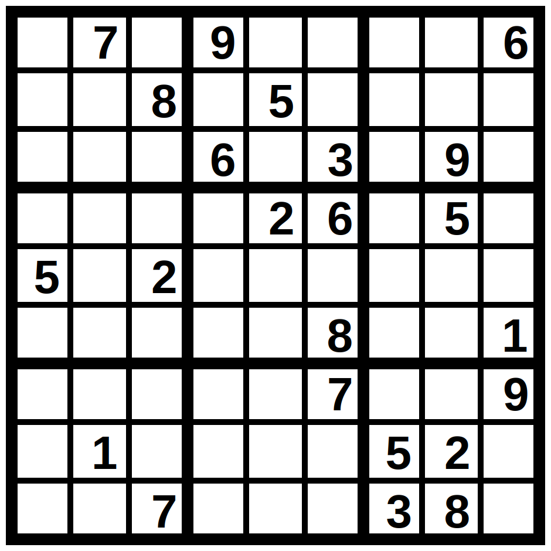

# Sudoku SVG converter
Small Python library for converting Sudoku string to `.svg` files (**0** library dependencies, **1** `.svg` template required).

## Weight of SVG's
Default template size: 2234 bytes.

Without all comments (including `insert_numbers_here`) and blank lines: 2054 bytes.

With default template one clue in puzzle weights about 35 bytes.

Easy puzzles have most clues already filled in. They contain about 45 clues at most. So, size of `output.svg` with **easy unsolved** puzzle in worst (practical) case is **about 3629 bytes** without comments.

Solved puzzles contain 81 clues, then size of **solved** puzzle is **4889 bytes** without comments.

So, SVG's generated with this program won't cause slow loading of your website.

## Examples
Here is how default template looks like:


### Through shell:

```sh
python3 sudoku_svg.py .7.9....6..8.5.......6.3.9.....26.5.5.2...........8..1.....7..9.1....52...7...38.
```

Generates output.svg (in the same directory), which looks like this (with default template):



### Through code:
```python3
from sudoku_svg import SudokuSVG

# 1. path to standard template
# 2. template for number tag
# 3. lambda for computing x and y values for tag
svg = SudokuSVG("template.svg",
                StringTemplate('\t\t<tspan x="$x" y="$y">$n</tspan>\n'), 
                lambda x, y: [50 + x * 100, 80 + y * 100])

puzzle = "6.7...8.42.........83....1........8..1..3......4567....2...1......7.84.5...64...."

# generates file output.svg with this puzzle
svg.generate("output.svg", puzzle)
```

## Customize
If you don't like how standard template looks, you can either change it or create your own.

Here are some instructions:

1. Create/find `.svg` file for Sudoku grid.
2. Insert `<!-- insert_numbers_here -->` where you want numbers tag to go.
3. Write template for numbers tag. Example: `'\t\t<tspan x="$x" y="$y">$n</tspan>\n'` (where `n` - number to place, `x` and `y` is position of this number).
4. Write lambda for computing position of numbers tag. Example: `lambda x, y: [50 + x * 100, 80 + y * 100]` (`x` and `y` values from template will be replaced with first and second numbers in returned array respectively).

That's it. See `template.svg`, `sudoku_svg.py`, `example_output.svg` for more details.

## To-do
* Improve `.svg` template.
* More command line arguments.
* Option for comments removing.
* Load template through strings.
